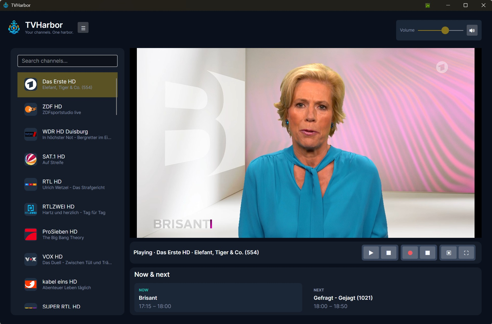
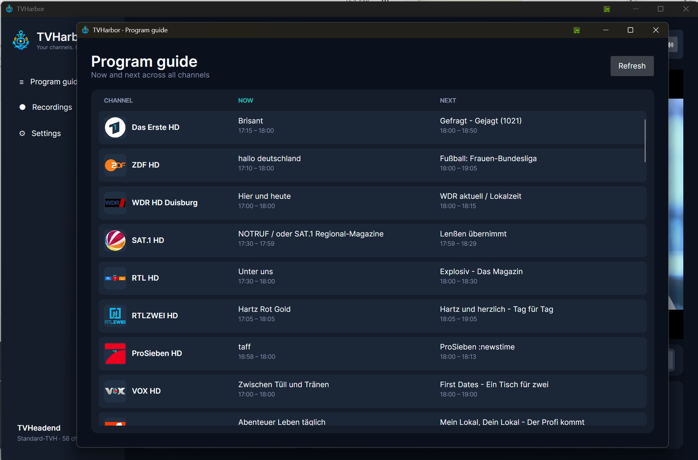
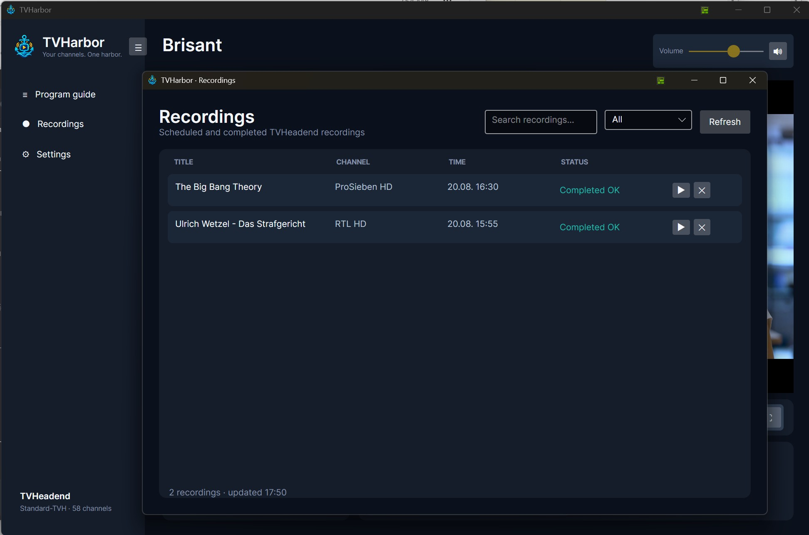
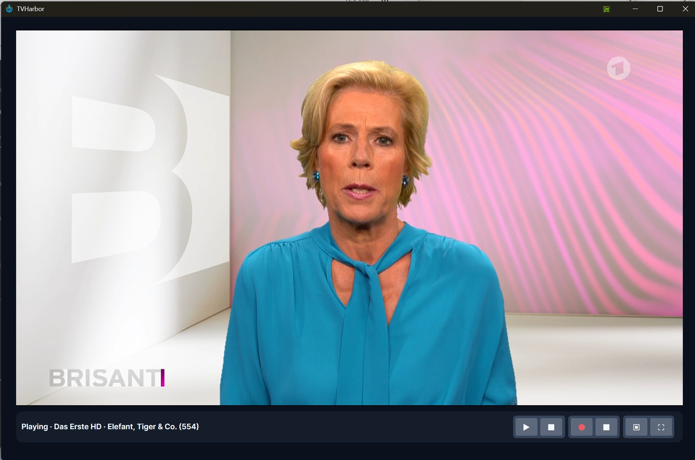
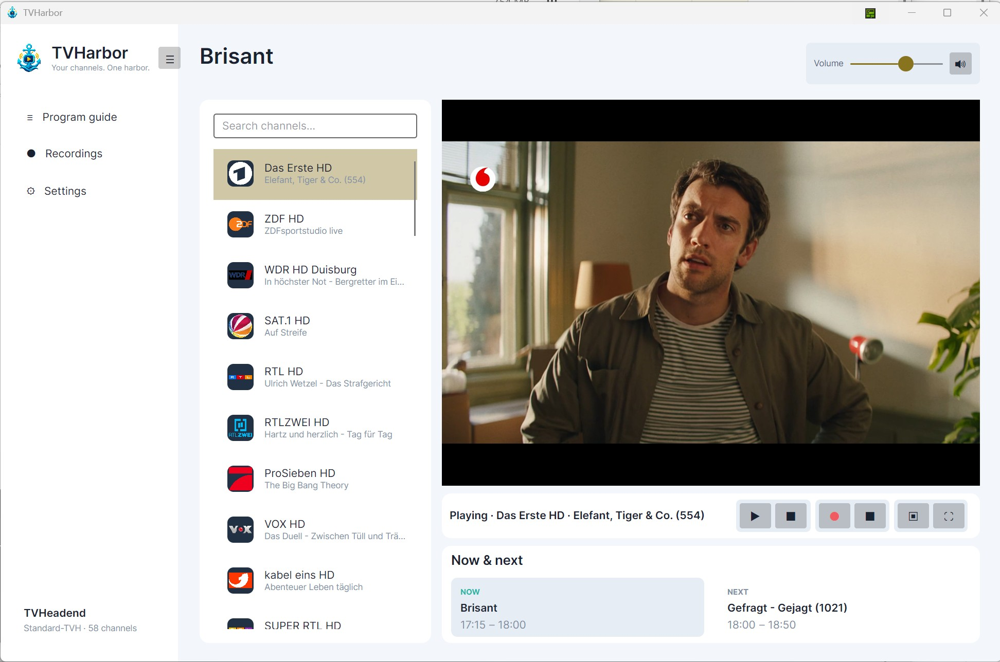
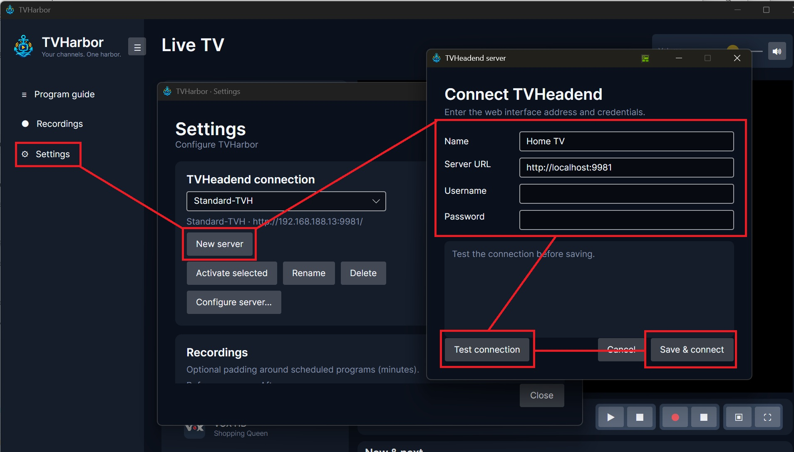

# TVHarbor Public Beta

TVHarbor is a desktop client for **TVHeadend** with an integrated VLC-based player.

> [!IMPORTANT]
> TVHarbor is currently in **public beta**. The application is already stable in daily testing, but features and behavior may still change before the first final release.

The public beta is currently available for **Windows x64** and **Linux (Debian/Ubuntu, x64)**. The Linux build is distributed as a `.deb` package and has been tested on Ubuntu. A macOS version is planned for a later stage.

## Features

### Live TV

- Browse all channels provided by TVHeadend
- Search and filter channels by name
- Display channel logos, including cached and SVG logos
- Show the currently running programme below each channel
- Start playback from the channel list or via double-click
- Stop and resume playback
- Switch channels directly in the main window
- Fullscreen playback
- Integrated VLC-based playback
- Volume control with persistent startup volume
- Mute / unmute control
- Automatic EPG refresh while watching
- Current and next programme information
- Cinema Mode for a larger, distraction-free viewing area

### Programme guide

- View current and upcoming programmes for all channels
- Channel logos directly in the guide
- Local programme times
- Start live playback by double-clicking a programme
- Manual EPG refresh

### Recordings

- Schedule recordings for the selected channel and programme
- Schedule recordings directly from the programme guide
- Stop active recordings
- View scheduled, active, completed and failed recordings
- Search and filter recordings
- Play completed recordings in the integrated player
- Delete recordings from TVHeadend

### TVHeadend server profiles

- Configure multiple TVHeadend server profiles
- Store server name, URL, username and password
- Test a connection before saving
- Switch between configured servers directly from TVHarbor
- Add, rename and delete profiles
- Persist the active server between application starts

### Appearance and layout

- Dark and light themes
- Collapsible navigation sidebar
- Persistent sidebar state
- Persistent window size and position
- Responsive layout with priority on the video area
- Cinema Mode for an expanded playback view

### Settings

- Startup volume
- EPG refresh interval
- Recording padding before and after programmes
- Clear cached channel logos
- Application appearance
- Open the TVHeadend web interface directly from TVHarbor

## Screenshots

### Main window



### Programme guide



### Recordings



### Cinema Mode



### Light Theme



## Requirements

### Windows

- Windows x64
- A reachable TVHeadend server
- TVHeadend user credentials with access to the required channels, EPG and recording functions

The necessary VLC runtime libraries are bundled with the Windows build, so a separate VLC installation is **not required**.

### Linux

- Debian/Ubuntu x64 (currently tested on Ubuntu)
- A reachable TVHeadend server
- TVHeadend user credentials with access to the required channels, EPG and recording functions
- libVLC/VLC runtime packages installed on the system

## Linux installation

Download the current `.deb` package from the release:

```bash
wget https://github.com/all-solutions/TVHarbor-PublicBeta/releases/download/0.1.3/tvharbor_0.1.3_amd64.deb
```

Install the required VLC/libVLC runtime packages:

```bash
sudo apt update
sudo apt install libvlc5 libvlccore9 vlc-plugin-base
```

Then install TVHarbor:

```bash
sudo apt install ./tvharbor_0.1.3_amd64.deb
```

The Linux package is currently tested on **Ubuntu**. Feedback from other Debian/Ubuntu-based distributions is very welcome during the public beta.

## Connecting TVHarbor to TVHeadend

After starting TVHarbor for the first time, open **Settings → TVHeadend Server Profiles** and create a profile for your TVHeadend server.

Enter a name for the profile, the URL of your TVHeadend server and the username and password of a TVHeadend user. The server URL should include the protocol and port, for example `http://192.168.1.10:9981`.

Use **Test Connection** to verify that TVHarbor can reach and authenticate against the server before saving the profile. Once saved and selected as the active profile, TVHarbor will load the available channels, EPG data and recordings from that TVHeadend server.



> [!TIP]
> If the connection test fails, first verify that the TVHeadend web interface is reachable from the same computer and that the configured TVHeadend user has the required access permissions.

## Public Beta

This repository is used for the **public beta distribution and feedback** of TVHarbor.

The application itself is still under active development. During the beta phase you may encounter bugs, UI changes or incomplete functionality.

If you find a problem, please open an **Issue** in this repository and include as much information as possible, for example:

- TVHarbor version
- Operating system and version
- TVHeadend version
- A short description of what happened
- Steps to reproduce the problem
- Screenshots or logs, if available

Feature requests and general feedback are also very welcome.

## Planned

Among the features currently being considered for future versions are:

- ~~Linux support~~ ✅ **Available in the Public Beta** — Debian/Ubuntu (`.deb`), currently tested on Ubuntu
- macOS support
- Subtitle / closed-caption track selection
- Audio track selection
- Additional playback and usability improvements

## Source code

TVHarbor is currently distributed as a **public beta build**, while the main development repository remains private.

No final decision has been made yet on whether the complete TVHarbor source code will eventually be published as open source. This is not intended to prevent community feedback or participation; during the public beta, feedback, bug reports and feature suggestions are explicitly welcome through this repository.

The main reason for keeping the development repository private for now is the increasing amount of source code — and in some cases complete projects — being copied, minimally modified and republished under a different name without meaningful attribution or contribution back to the original project. Because a considerable amount of development time has gone into TVHarbor, I want to evaluate the best way to make the project available long-term without unnecessarily encouraging that kind of reuse.

For the time being, the public repository therefore provides the current Windows and Linux builds, documentation, screenshots, releases and issue tracking, while active development continues in a private repository. The licensing and source-code model may be revisited once TVHarbor has progressed beyond the beta phase.

## Disclaimer

TVHarbor is an independent project and is not affiliated with or endorsed by the TVHeadend project or VideoLAN.

TVHeadend is a separate open-source project. VLC and libVLC are trademarks and technologies of the VideoLAN project.
