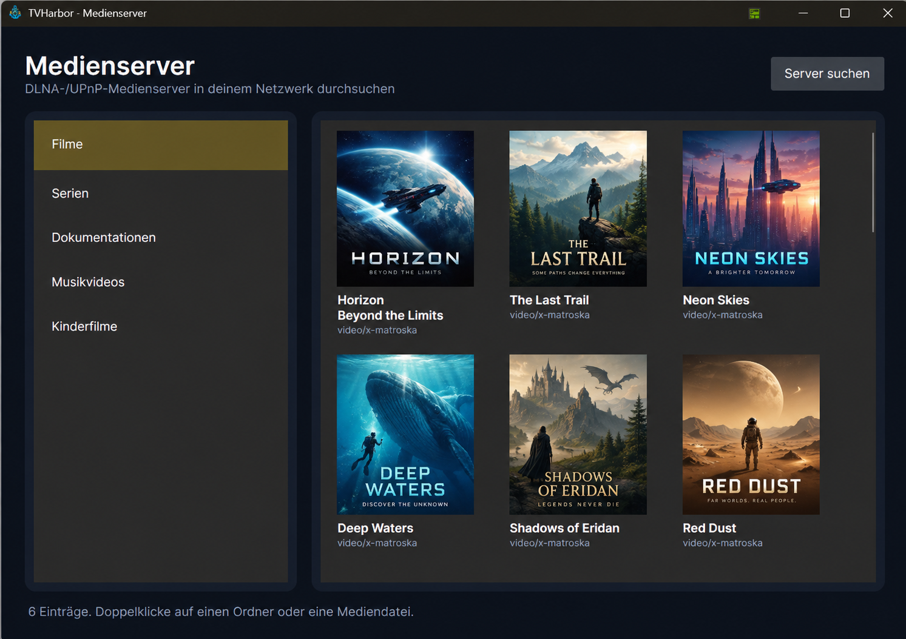

# TVHarbor Public Beta

TVHarbor is a cross-platform desktop client for **TVHeadend** with an integrated VLC-based player, combining Live TV, EPG, recording management and media-server playback in a single application.

> [!IMPORTANT]
> TVHarbor is currently in **public beta**. It is already used and manually tested on all supported desktop platforms, but features and behavior may still change before the first final release.

## Supported platforms

TVHarbor is currently available for:

- **Windows x64**
- **Linux amd64** — Debian/Ubuntu `.deb`
- **macOS Intel x64** — Apple Silicon supported through Rosetta 2

Windows and macOS builds include the required VLC runtime. No separate VLC installation is required.

The Linux `.deb` package declares the required playback dependencies so they can be resolved automatically during installation.

## Features

### 📺 Live TV

- Browse all channels provided by TVHeadend
- Search and filter channels by name
- Display channel logos, including cached and SVG logos
- Show the currently running programme below each channel
- Start playback from the channel list or via double-click
- Stop and resume playback
- Switch channels directly in the main window
- Fullscreen playback
- Integrated VLC-based playback
- Volume control with persistent startup volume
- Mute / unmute control
- Automatic EPG refresh while watching
- Current and next programme information
- Cinema Mode for a larger, distraction-free viewing area

### 📅 Programme Guide

- View current and upcoming programmes for all channels
- Configure the number of displayed programmes from **2 to 10**
- Display channel logos in the guide
- Show local programme times
- Open programme details including title, broadcast time, subtitle, summary and description where provided by TVHeadend
- Start Live TV by double-clicking a programme
- Schedule recordings directly from the Programme Guide
- Scheduled and active recordings are marked in the guide
- Delete scheduled recordings directly from the guide
- Detect recordings created directly in TVHeadend
- Recording matching takes pre/post-padding and consecutive programmes into account
- Manual EPG refresh

### 📼 Recordings

- Schedule recordings for the selected channel and programme
- Schedule recordings directly from the Programme Guide
- Configure pre- and post-recording padding
- Stop active recordings
- View scheduled, active, completed and failed recordings
- Display the TVHeadend enabled/disabled state
- Filter recordings by status and enabled state
- Search recordings
- Play completed recordings directly in the main TVHarbor player
- Pause and resume recording playback
- Delete recordings from TVHeadend
- Localized recording states

### 🎞️ Media servers — DLNA / UPnP

TVHarbor can browse and play media from compatible **DLNA / UPnP media servers** on the local network.

- Discover DLNA / UPnP media servers
- Configure and save media libraries in Settings
- Add multiple servers, libraries and folders
- Saved libraries appear directly in the TVHarbor sidebar
- Browse folders and media in a visual media grid
- Display artwork supplied by the media server
- Cache downloaded artwork locally
- Open folders directly from the media grid
- Play supported media in the integrated TVHarbor player
- Pause and resume media playback
- Display media titles during playback instead of the underlying URL
- Improved compatibility with Plex and Emby DLNA servers

Feedback about compatibility with other media servers is very welcome.

### 🖥️ TVHeadend server profiles

- Configure one or more TVHeadend server profiles
- Store server name, URL, username and password
- Test a connection before saving
- Support for anonymous access, Basic authentication and Digest authentication
- Switch between configured TVHeadend servers directly from TVHarbor
- Add, rename and delete profiles
- Persist the active server between application starts

### 🌍 Languages

TVHarbor currently includes:

- English
- German
- French
- Spanish
- Italian

The application language can be changed directly in Settings. English is the default language.

**Additional languages are welcome.**

If you would like to see TVHarbor in another language, feel free to request it. Please keep in mind that languages I don't speak myself will necessarily be translated somewhat **"blind"**, so feedback and corrections from native speakers are especially welcome.

### 🎨 Appearance and layout

- Dark and light themes
- Theme-aware interface
- Collapsible navigation sidebar
- Persistent sidebar state
- Persistent window size and position
- Responsive layout prioritizing the video area
- Cinema Mode
- Cross-platform fullscreen playback
- TVHarbor application icon and platform-specific packaging

### ⚙️ Settings

- Startup volume
- EPG refresh interval
- Number of programmes displayed per channel
- Recording padding before and after programmes
- Application language
- Application theme
- TVHeadend server profiles
- Media-server libraries
- Clear cached channel logos
- Open the TVHeadend web interface directly from TVHarbor

## Screenshots

### Main window


### Programme guide


### Recordings


### Cinema Mode


### Media Server



### Light Theme


## Installation

Download the appropriate package for your platform from the **latest TVHarbor release**:

https://github.com/all-solutions/TVHarbor-PublicBeta/releases/latest

### Windows

Download the Windows installer (`.exe`) and run it.

The required VLC runtime is bundled with TVHarbor. A separate VLC installation is **not required**.

### Linux — Debian / Ubuntu

Download the current `amd64.deb` package from the latest release.

Install it using:

```bash
sudo apt install ./tvharbor_<version>_amd64.deb
```

The package declares the required playback dependencies so that `apt` can resolve and install them automatically.

TVHarbor has been manually tested on Debian and Ubuntu. Feedback from other Debian/Ubuntu-based distributions is very welcome.

### macOS

Download the macOS x64 ZIP from the latest release.

1. Unpack the ZIP archive.
2. Open **TVHarbor.app**.

The required VLC runtime is included, so no separate VLC installation is required.

The current macOS build targets **Intel x64**. Apple-Silicon Macs can run TVHarbor through **Rosetta 2**.

> [!NOTE]
> macOS support is still considered a **beta preview**. Live TV video and audio playback have been tested successfully, but feedback from additional macOS systems is especially welcome.

## Connecting TVHarbor to TVHeadend

After starting TVHarbor for the first time, open **Settings → TVHeadend Server Profiles** and create a profile for your TVHeadend server.

Enter:

- A name for the profile
- The URL of your TVHeadend server
- Username and password, if authentication is required

The server URL should include the protocol and port, for example:

```text
http://192.168.1.10:9981
```

Use **Test Connection** to verify that TVHarbor can reach and authenticate against the server before saving the profile.

Once saved and selected as the active profile, TVHarbor will load the available channels, EPG data and recordings from that TVHeadend server.


> [!TIP]
> If the connection test fails, first verify that the TVHeadend web interface is reachable from the same computer and that the configured TVHeadend user has the required access permissions.

## Public Beta

This repository is used for the **public beta distribution and feedback** of TVHarbor.

The application is under active development. During the beta phase you may encounter bugs, UI changes or incomplete functionality.

If you find a problem, please open an **Issue** and include as much information as possible:

- TVHarbor version
- Operating system and version
- TVHeadend version
- A short description of the problem
- Steps to reproduce it
- Screenshots or logs, if available

Bug reports, translation corrections, media-server compatibility reports, feature requests and general feedback are all very welcome.

## Platform progress

- ~~Linux support~~ ✅ **Available** — Debian/Ubuntu (`.deb`)
- ~~macOS support~~ ✅ **Available as beta preview** — Intel x64 / Apple Silicon via Rosetta 2

## Planned / under consideration

Some areas currently being considered for future versions include:

- Subtitle / closed-caption track selection
- Audio track selection
- Additional media-server compatibility
- Additional languages
- Further playback and usability improvements

## Source code

TVHarbor is currently distributed as a **public beta build**, while the main development repository remains private.

No final decision has been made yet on whether the complete TVHarbor source code will eventually be published as open source. This is not intended to prevent community feedback or participation; feedback, bug reports and feature suggestions are explicitly welcome through this repository.

The main reason for keeping the development repository private for now is the increasing amount of source code — and in some cases complete projects — being copied, minimally modified and republished under a different name without meaningful attribution or contribution back to the original project.

Because a considerable amount of development time has gone into TVHarbor, I want to evaluate the best way to make the project available long-term without unnecessarily encouraging that kind of reuse.

For the time being, this public repository therefore provides the current **Windows, Linux and macOS builds**, documentation, screenshots, releases, discussions and issue tracking, while active development continues in a private repository.

The licensing and source-code model may be revisited once TVHarbor has progressed beyond the beta phase.

## Disclaimer

TVHarbor is an independent project and is not affiliated with or endorsed by the TVHeadend project, VideoLAN, Plex or Emby.

TVHeadend is a separate open-source project. VLC and libVLC are trademarks and technologies of the VideoLAN project. Other product and company names mentioned are trademarks of their respective owners.
